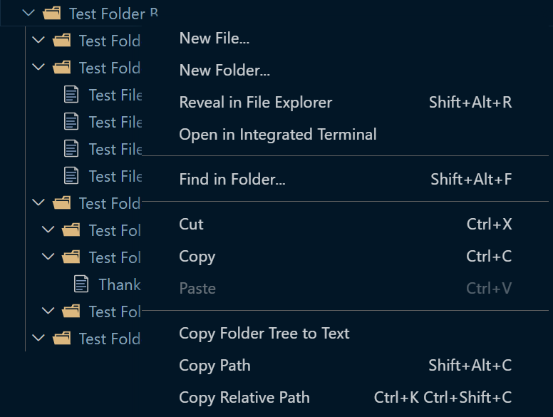
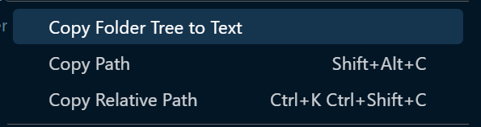

# copyfoldertree

Simplify copying your VS Code folder structure to text.

## Features

Open explorer tab in the side bar to view folder structure


Right click on a folder you want to view the tree structure of in text format



Press on 'Copy Folder Tree to Text'




Paste the text folder tree structure anywhere you like.


## Requirements

To set up a development environment:

1. Clone the repository.
2. Run ```npm install``` to install dependencies.
3. Open the project in Visual Studio Code.
4. Press F5 to open a new VS Code window with the extension loaded.

## Extension Settings

This extension contributes the following setting:

* `copyfoldertree.copy`: Gets the folder structure as a text tree folder structure

## Known Issues

No known issues so far.

## Release Notes

### 1.0.0

Initial release of copyfoldertree

---

## License

Please do not just copy and paste the source code. Feel free to use as inspiration.

Copyright © 2024 Marwan ElKhodary.